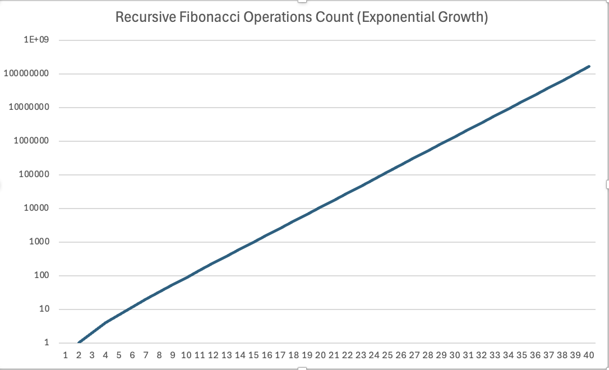
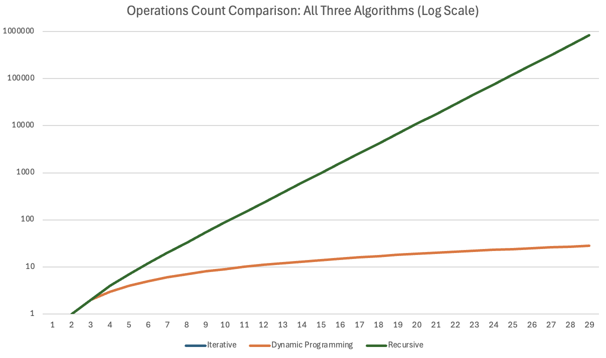

[](https://classroom.github.com/a/kdfTwECC)
# Midterm p1: Report on Analysis of Fibonacci  Series
* **Author**: Maggie Li
* **GitHub Repo**: https://github.com/CS5008Fall2025/midterm-report-maggiesomiakiraneu/tree/main
* **Semester**: Fall 2025
* **Languages Used**: c, update


## Overview
This report looks at how three different methods calculate the Fibonacci sequence: iterative, recursive, and dynamic programming. The Fibonacci sequence is an important idea in math and computer science, where each number is the sum of the two numbers before it.
#### what is the Fibonacci Sequence?
In Math, Fibonacci Sequence is defined as:

F(0)=0

F(1)=1

F(n)=F(n−1)+F(n−2) for n≥2

The sequence begins: 0, 1, 1, 2, 3, 5, 8, 13, 21, 34, 55, 89, 144...


#### Algorithm Implementations and Complexity Analysis

The following table summarizes the time and space complexity for each algorithm:

| Algorithm | Time Complexity | Space Complexity |
|-----------|----------------|------------------|
| Iterative | O(n) | O(1) |
| Recursive | $O(2^n)$ | O(n) |
| Dynamic Programming | O(n) | O(n) |


#### 1. Iterative Algorithm
#### Here is the Pseudo code

```
 fib_iterative(n):
    IF n = 0 THEN
        RETURN 0
    IF n = 1 THEN
        RETURN 1
    
    prev2 =0 
    prev1 =1 
    
    FOR i FROM 2 TO n: #iterating from 2 to n here
        current = prev1 + prev2
        prev2 = prev1
        prev1 = current
    END FOR
    
    RETURN current

```

#### Big O Analysis:
The iterative method uses one loop that runs from 2 to n. Each loop step does a few simple operations. 

- The loop runs (n - 1) times.
- Each loop step takes constant time O(1).
- Total time = T(n) = c × (n - 1) = O(n)

Space Complexity:

1. It uses only three variables (prev2, prev1, current) regardless of input size
Space
1. S(n) = O(1)

Therefore, Time: O(n), Space: O(1).


#### 2. Recursive Algorithm

**Pseudo Code:**
```
fib_recursive(n):
    IF n = 0 THEN
        RETURN 0
    IF n = 1 THEN
        RETURN 1
    
    RETURN fib_recursive(n-1) + fib_recursive(n-2)
```

#### Big O Analysis:

The recursive approach is different compared to iterative approcah. It calls itselfs in the function. It creates a binary tree of function calls, where each node represents a function call and branches to two more calls (except for base cases).


Time Complexity Derivation using Recurrence Relation.

#### Lower Bound:
To prove my Big(O), first, we will find the lower bound by approximating T(n-1) ≈ T(n-2), though T(n-1) ≥ T(n-2):

T(n) = T(n-1) + T(n-2) + c

= 2T(n-2) + c    //from the approximation T(n-1) ~ T(n-2)

= 2*(2T(n-4) + c) + c

= 4T(n-4) + 3c

= 8T(n-6) + 7c

= 2^k * T(n - 2k) + (2^k - 1)*c

Then, we will find the value of k for which n - 2k = 0, therefore k = n/2


T(n) = $2^{n/2}$ * T(0) + ($2^{n/2}$ - 1) * c

= $2^{n/2}$ * (1 + c) - c


Lower Bound: **T(n) ≥ $2^{n/2}$** 

#### Upper Bound:


T(n) = T(n-1) + T(n-2) + c

≤ 2T(n-1) + c //from the approximation T(n−2) to T(n−1)

= 2(2T(n-2) + c) + c

= 4T(n-2) + 3c

= 8T(n-3) + 7c

= $2^k$* T(n - k) + ($2^k$ - 1) * c


Let's find the value of k for which: n - k = 0, therefore k = n

T(n) = $2^n$ * T(0) + ($2^n$ - 1) * c

= $2^n$ * (1 + c) - c

Therefore: **T(n) ≤ $2^n$** (upper bound)


$2^{n/2}$ ≤ T(n) ≤ $2^n$

So, the time complexity is $O(2^n)$ or exponential.

**Space Complexity:**
- The call stack depth equals the longest path from root to leaf
- Maximum recursion depth = n (following the n-1 branch all the way down)
- Space: S(n) = O(n)

Therefore, **Time: $O(2^n)$, Space: O(n)**.


This method is simple to understand but very slow. For example, calculating F(40) takes around 1 trillion steps. It's too slow for most uses.

#### 3. Dynamic Programming Algorithm

**Pseudo Code:**
```
GLOBAL memo_table ← empty array of size MAX

fib_dp(n):
    IF n = 0 THEN
        RETURN 0
    IF n = 1 THEN
        RETURN 1
    
    IF memo_table[n] is not empty THEN
        RETURN memo_table[n]
    
    memo_table[n] =fib_dp(n-1) + fib_dp(n-2)
    RETURN memo_table[n]

```

**Big O Analysis:**

Dynamic programming saves results from earlier calculations.
When the function needs a value again, it just looks it up instead of recalculating it.

Time Complexity Derivation:
- Each unique value F(0) through F(n) is calculated only once
- After the first calculation, any repeated call just looks up the value in O(1) time
- There are n + 1 unique numbers
- Each calculation takes O(1) time (addition and storing in the table)
- T(n) = O(n)


Alternative Analysis:
- The recursion tree still exists, but repeated branches are removed
- The tree becomes more linear because each value is calculated only once
- Total function calls: approximately 2n - 1 because cached values return immediately

Space Complexity:
- Memoization table stores n + 1 values: S_table(n) = O(n)
- Call stack depth (worst case): O(n)
- Total space: S(n) = O(n)

Therefore, **Time: O(n), Space: O(n)**.

Dynamic programming is as fast as the iterative method O(n) but uses space O(n) instead of O(1). This trade-off is often worthwhile for problems where the recursive structure is more natural to express.


## Empirical Data & Discussion 

In this section, we show the actual performance data collected from running the three Fibonacci algorithms and compares the empirical results against the theoretical Big O analysis.

### Data Collection Methodology

All the empirical data was collected using automated test scripts, which ran each algorithm many times with increasing values of N. We measured the time using high-resolution timers and counted operations by adding to counters at important points in each algorithm. Each test continued until it finished or reached a 60 second timeout limit.

### Operations Count Analysis

The following table shows the number of operations performed by each algorithm for selected values of N (data collected from C implementation):

| N | Iterative | Dynamic Programming | Recursive |
|---|-----------|---------------------|-----------|
| 1 | 0 | 0 | 0 |
| 5 | 4 | 4 | 7 |
| 10 | 9 | 9 | 88 |
| 15 | 14 | 14 | 986 |
| 20 | 19 | 19 | 10,945 |
| 25 | 24 | 24 | 121,392 |
| 30 | 29 | 29 | 1,346,268 |
| 35 | 34 | 34 | 14,930,351 |
| 40 | 39 | 39 | 165,580,140 |
| 45 | 44 | 44 | 1,836,311,902 |

The operations data confirms our Big O analysis:

#### Iterative and Dynamic Programming O(n): 
Both algorithms show perfect linear growth in operations. For both algorithms, the operations follow the formula: operations = N-1. When N = 10, each performs 9 operations, and when N = 45, each performs 44 operations. This matches exactly with the expected O(n) time complexity.

#### Recursive $O(2^n)$: 
The recursive algorithm shows exponential growth. Each increase of N approximately doubles the operations (it actually follows the Fibonacci sequence). The growth is very fast: from 88 operations at N = 10 to more than 1.8 billion operations at N = 45. This confirms the O(2^n) behavior and shows why the algorithm is not practical for large values.

### Timing Analysis

#### Recursive Algorithm Performance

The recursive algorithm demonstrates clear exponential time growth, becoming impractical for N > 40. The timing data from the C implementation shows:

| N | Recursive Time (seconds) |
|---|-------------------------|
| 10 | 0.000001 |
| 20 | ~0.004 |
| 30 | ~0.5 |
| 40 | ~0.97 |
| 41 | 0.97 |
| 42 | 1.58 |
| 43 | 2.55 |
| 44 | 4.17 |
| 45 | 6.73 |

The timing results show exponential growth; each increase of N increases the time by about the golden ratio 1.6 times, which matches the theoretical prediction. The recursive implementation stayed under the 60 second timeout for N = 45 in C, but in Python it timed out at N = 40, showing the extra overhead of interpreted execution.


Figure 1: Recursive Fibonacci operations count showing exponential $O(2^n)$ growth on logarithmic scale.

The exponential growth makes the recursive method impractical for values of N above 40–45. Even on modern hardware, the recursive version without memoization is limited by its $O(2^n)$ complexity.

#### Iterative and Dynamic Programming Performance

Both the iterative and dynamic programming implementations showed great performance, completing almost instantaneously for all tested values, below is the chart:

| N | Iterative Time (seconds) | DP Time (seconds) |
|---|-------------------------|-------------------|
| 10 | 0.000000 | 0.000001 |
| 20 | 0.000000 | 0.000000 |
| 30 | 0.000000 | 0.000000 |
| 40 | 0.000000 | 0.000000 |
| 45 | 0.000000 | 0.000000 |

For all tested values up to N = 45, both algorithms finished in less than 0.000001 seconds. The timing was so precise that it was close to the limit of the system timer, making it hard to see any performance differences at these small values. When testing larger values (up to N = 1000), both algorithms continued to show O(n) scaling, and their execution times stayed very small.


Figure 2: Operations count comparison for all three algorithms on logarithmic scale, clearly showing O(n) vs $O(2^n)$ growth patterns.

The logarithmic scale graph clearly shows the main differences between the algorithms. The lines for the iterative and dynamic programming methods look almost the same and increase slowly, forming a straight-line pattern on the log scale that confirms O(n) complexity. The recursive line rises very steeply, showing exponential growth.

### Language Comparison: C vs Python
From above, we learned that C is faster than Python in all cases. For the iterative algorithm, Python was about 2 to 3 times slower. For dynamic programming, it was about 3 to 5 times slower, and for the recursive algorithm, Python was 5 to 10 times slower. This difference in speed comes from several reasons. C is compiled into native machine code, while Python is interpreted. C also has direct memory access and no overhead from garbage collection. In Python, function calls take more time, and dynamic typing adds extra runtime checks. Despite these differences, both Python and C implementations showed the same Big O behavior, confirming that algorithmic complexity is the main factor affecting performance for large values of N.


## Language Analysis


### Why Python?

For the second language implementation, I selected Python for several compelling reasons. Python's high-level abstractions and extensive standard library make it ideal for rapid prototyping and algorithm exploration. The language's built-in support for dynamic programming through decorators like `@lru_cache` allows for elegant implementation of memoization without manual cache management. Additionally, Python's readability and expressiveness make it easier to focus on algorithmic concepts rather than low-level implementation details. As a widely-used language in data science and algorithm development, Python provides valuable experience for practical applications beyond this assignment.

### Language 1: C

Implementing the Fibonacci algorithms in C required careful attention to several low-level details that are abstracted away in higher-level languages.

The biggest challenge was managing the memoization table for the dynamic programming version. I used a static array dp_table[MAX] with a maximum size of 100,000 elements. This meant using memset() to reset the table to zero before each DP test run. I also had to make sure the table was reinitialized properly to keep a clean state between different runs. I thought about whether to use stack or heap memory, but static allocation was simpler since it avoided manual malloc and free operations.

Another challenge was handling the fast growth of Fibonacci numbers. I used uint64_t (an unsigned 64-bit integer) to store values up to F(93) before overflow happens. Defining typedef uint64_t ull made the code easier to read while keeping accuracy.

For timing, I used clock_gettime() with CLOCK_MONOTONIC to get precise measurements. The function calculates elapsed time in seconds by combining the seconds and nanoseconds from the timespec structure.

To track the number of operations, I passed a pointer to an unsigned long long counter through all function calls. This allowed each function to update the counter while still returning the Fibonacci result.

Even with these challenges, C showed clear performance benefits, running much faster than Python for all versions of the algorithm.


### Language 2: Python
The Python version showed how good the language is for quick development and having advanced features built in.

Python’s @lru_cache(maxsize=None) decorator from the functools module gives automatic memoization with just one line of code.

Also, Python has a default limit of about 1,000 recursive calls to prevent a stack overflow. To make the recursive Fibonacci work for larger numbers, I had to increase this limit. This is a restriction specific to Python. In C, recursion is only limited by the available stack space.

Python’s dynamic typing made development easier because I didn’t need to declare types explicitly. However, this convenience comes with a performance cost, as the interpreter checks types at runtime, making Python slower than C.

High-level features in Python helped speed up development. Functions like time.perf_counter() made timing simple and accurate, Enum classes helped organize algorithm types, and the argparse module handled command-line arguments easily. Memory management was also automatic, so I didn’t need to worry about it.

Python’s main advantages are rapid development, built-in memoization, cleaner and more readable code, and a rich standard library. The challenges include the recursion depth limit, which sometimes needed manual adjustment, slower execution speed, and the need to use global variables for counting operations, which is not ideal.

Overall, the Python implementation confirmed that algorithmic complexity determines performance patterns. Both Python and C showed the same O(n) and $O(2^n)$ behavior, even though their execution speeds were very different.


### Comparison and Discussion Between Experiences
The biggest difference between C and Python was the trade-off between development speed and execution performance. Python code was much faster to write and debug. Developing all three algorithms and the command-line interface took about half the time compared to C. However, this convenience came at a cost. C ran consistently faster. This is because C compiles to native machine code, while Python runs through an interpreter that adds extra overhead.

Memory management highlighted another key difference. In C, every array, pointer, and allocation must be carefully handled, giving more control but increasing complexity and the risk of bugs. Python handles memory automatically. This makes development simpler but takes away detailed control and can sometimes cause unexpected delays.

Python code was also shorter and easier to read. The dynamic programming version only required adding @lru_cache to the recursive function, while C needed a separate table, initialization, and cache logic. Timing and command-line parsing were simpler in Python, using time.perf_counter() and argparse, compared to manual handling in C.

Each language had its own constraints. In Python, the recursion limit had to be increased using sys.setrecursionlimit() to handle large Fibonacci numbers. In C, I had to use uint64_t carefully to prevent integer overflow. Python can handle very large integers automatically, but this comes with extra computational cost.

Debugging and testing were easier in Python, with informative error messages, clear stack traces, and an interactive REPL for quick testing. C caught type errors at compile time but runtime errors like segmentation faults were harder to diagnose, and every change required recompilation.

Performance was more predictable in C, with consistent execution times, while Python’s speed could vary due to garbage collection, interpreter overhead, and dynamic dispatch. For applications needing reliability and speed, C’s consistency was a clear advantage.

Overall, Python offered faster development and simpler code, while C delivered better performance, predictable behavior, and finer control over memory and execution.

## Conclusions / Reflection

This project gave me valuable insights into how algorithm theory connects to real-world performance and highlighted key differences between programming languages. The main lesson I learned is that choosing the right algorithm is much more important than the programming language or small optimizations. The recursive Fibonacci algorithm with $O(2^n)$ complexity became impractical beyond N=45 even in optimized C, while the O(n) iterative and dynamic programming solutions handled N=1000 easily in both C and Python. 

Seeing Big O in action made it clear. The number of recursive operations grew from 88 at N=10 to over 1.8 billion at N=45, while the iterative solution grew linearly. Dynamic programming was especially powerful, turning a natural recursive solution into an O(n) algorithm through memoization. In Python, adding a single @lru_cache decorator achieved this, showing how language features can make advanced techniques easy to use.

Working in both C and Python revealed the trade-offs between development speed and performance. C required careful memory management and type declarations but produced predictable, fast code. Python allowed faster development with cleaner, simpler code, but execution was slower and less predictable. Debugging and testing also differed. Python gave clear error messages and easy testing, while C caught some errors at compile time, but runtime faults were harder to track down.

The project also taught practical lessons, such as managing the memoization table in C, handling recursion limits in Python, and measuring timing accurately. Automating tests saved time and improved accuracy, showing the value of good tools. Writing the report while coding helped me understand the concepts better, and visualizations made performance patterns easier to see.

Overall, the project linked theory to practice, confirming Big O predictions while showing how factors like constant values, implementation decisions, and language design influence performance. It reinforced that thinking carefully about algorithms is more important than the choice of language, tool, or hardware. Seeing theory in action and watching how exponential growth quickly makes problems impossible to solve gave me a deeper understanding that will guide my future work in computer science.

## References

Big O, Big Efficiency : Recursion vs. Iteration Unveiled, Jun 2024, retrived in Oct 2025, from https://medium.com/@ireneselenam/big-o-big-efficiency-recursion-vs-iteration-unveiled-f0707501be5b

Solving Recurrences Example - Fibonacci (Recursion-Tree Method), 2017, retrived in Oct 2025, from https://www.youtube.com/watch?v=cDdSVCcugxg

Fibonacci Iterative vs. Recursive, Aug 2018, retrived in Oct 2025, from https://syedtousifahmed.medium.com/fibonacci-iterative-vs-recursive-5182d7783055

Dynamic Programming, https://www.cs.cmu.edu/~avrim/451f11/lectures/lect1006.pdf

Dynamic Programming (DP) Introduction, Aug 2025, retrived in Oct 2025 from https://www.geeksforgeeks.org/dsa/introduction-to-dynamic-programming-data-structures-and-algorithm-tutorials/